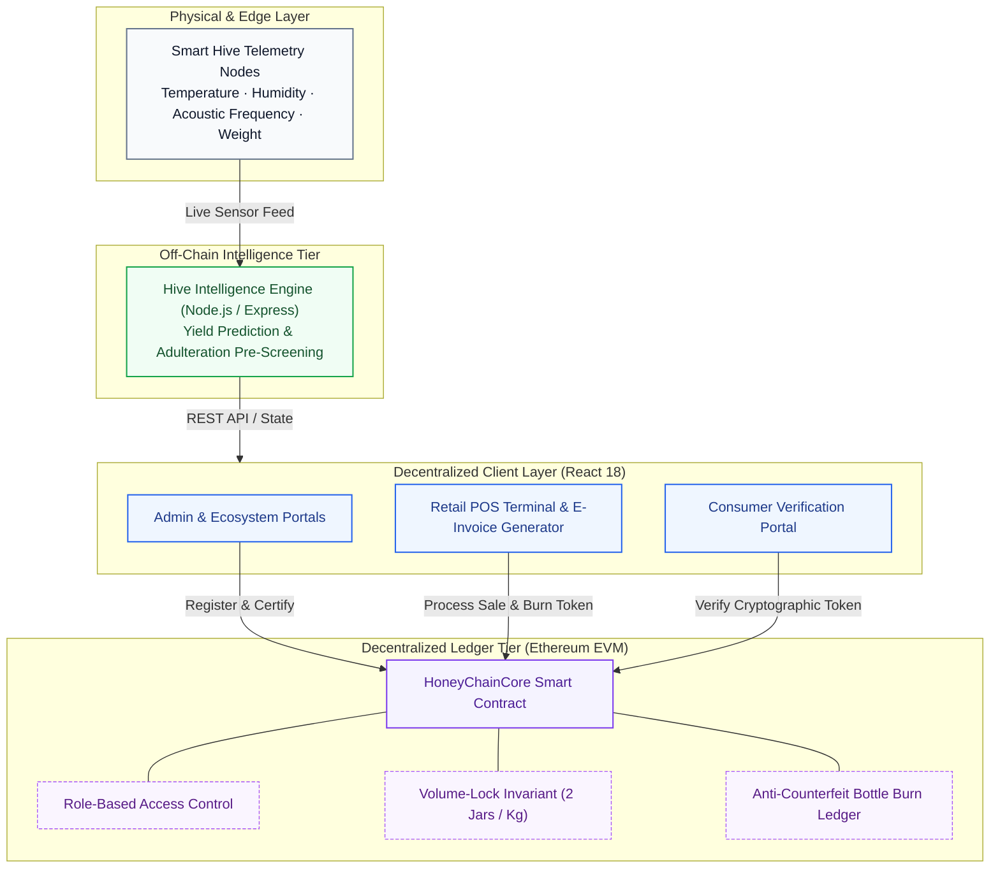

# HoneyChain

End-to-end blockchain traceability for India's KVIC Honey Mission — from smart hive to retail shelf to consumer QR scan.

> Built to eliminate honey adulteration. Every batch is cryptographically linked to a registered beekeeper, verified through on-chain lab certification, and tracked with a tamper-proof bottle-level receipt at the point of sale.

---

## Architecture



## Honey Batch Lifecycle

```mermaid
flowchart LR
    H["Harvest<br/>Apiary Logged"]
    -->|Yield Verified| L["Lab Analysis<br/>Purity Certified"]
    -->|NMR Passed| P["Processing<br/>Volume Locked"]
    -->|Sealed Inventory| D["Distribution<br/>Custody Handover"]
    -->|Stock Transferred| R["Retail POS<br/>Single-Use Sale"]
    -->|Digital Invoice QR| C["Consumer<br/>Origin Verified"]

    classDef stage fill:#f8fafc,stroke:#334155,stroke-width:1.5px,color:#0f172a;
    classDef gate fill:#eff6ff,stroke:#2563eb,stroke-width:1.5px,color:#1e3a8a;
    classDef verify fill:#f0fdf4,stroke:#16a34a,stroke-width:1.5px,color:#14532d;

    class H,L,P,D stage;
    class R gate;
    class C verify;
```



---

## The Problem

Honey adulteration with corn syrup, rice syrup, and C4 inverted sugars is rampant. Traditional quality checks are easy to game — there's no verifiable chain of custody from apiary to shelf. Beekeepers lose income, consumers get cheated, and there's no audit trail.

HoneyChain fixes this with an immutable on-chain record at every stage: harvest → lab → processing → distribution → retail → consumer.

---

## How It Works

**Three core parts:**

1. **`contracts/HoneyChainCore.sol`** — The source of truth. Enforces role-based access, volume locking (`jarsTotal = yieldKg × 2`), and one-time bottle sale burn. No stage can be skipped.

2. **`hive-intelligence-service/`** — Express service that provides real-time calibrated IoT telemetry streaming, FSSAI adulteration pre-screening, saturating yield prediction, and offline apiary sync.

3. **`client/`** — React web application with dedicated manual workflow portals for every role: KVIC Admin, Beekeeper, Lab Analyst, Processing Center, Logistics Distributor, Retail POS, and public Consumer Verification.

---

## Quickstart

### Prerequisites

- Node.js 16+
- [Ganache](https://trufflesuite.com/ganache/) (GUI or CLI)
- MetaMask browser extension

### 1. Install dependencies

```bash
git clone https://github.com/vikas-6/HoneyChain.git
cd HoneyChain

npm install
cd client && npm install && cd ..
cd hive-intelligence-service && npm install && cd ..
```

### 2. Start Ganache

Open the Ganache app and make sure it's running on:

- **RPC:** `http://127.0.0.1:8545`
- **Network ID:** `1337`

### 3. Deploy the Smart Contracts

```bash
npm run compile
npm run migrate
```

`accounts[0]` becomes the KVIC Admin automatically.

### 4. Connect MetaMask

Import Ganache accounts into MetaMask using the private keys shown in Ganache. Switch to the **Ganache Local** network (chainId 1337).

### 5. Run the Application

```bash
npm run dev
```

- React frontend: [http://localhost:3000](http://localhost:3000)
- Hive Intelligence API: [http://localhost:5001](http://localhost:5001)

---

## Test Accounts (Ganache defaults)

| Account       | Role                            | What they can do                  |
| ------------- | ------------------------------- | --------------------------------- |
| `accounts[0]` | **KVIC Admin**                  | Assign roles, view all dashboards |
| `accounts[1]` | **Beekeeper**                   | Register hives, log harvests      |
| `accounts[2]` | **Lab Analyst**                 | Run purity tests, certify batches |
| `accounts[3]` | **Processor**                   | Lock jar volumes, seal batches    |
| `accounts[4]` | **Distributor** (North Fleet)   | Dispatch batches to retail        |
| `accounts[5]` | **Retailer** (New Delhi)        | POS checkout, issue tax e-Bills   |
| `accounts[6]` | **Distributor** (Western Cargo) | Mumbai route                      |
| `accounts[7]` | **Retailer** (Mumbai)           | POS checkout, Bandra store        |

---

## Role-Based Access

Navigation is filtered by the connected wallet's role:

- **Admin** — sees everything; Retail POS is read-only (can switch between retailers via dropdown to audit)
- **Beekeeper** — Harvest portal only
- **Lab** — Lab Purity portal only
- **Retailer** — Retail POS only
- **Public / Consumer** — QR Verify page only

---

## Key Anti-Adulteration Mechanisms

**Volume lock** — `jarsTotal` is computed as `yieldWeightKg × 2` at processing and permanently locked on-chain.

**One-time bottle burn** — each bottle ID can only be sold once. Re-selling the same ID is rejected at the contract level.

**Lab gate** — batches cannot advance past lab stage unless a KVIC-authorized lab wallet has certified them as pure.

**Consumer token verify** — QR codes encode a cryptographic token derived from batch ID + unit number + harvest timestamp + salt. Tokens can't be guessed or enumerated.

---

## Project Structure

```
HoneyChain/
├── contracts/HoneyChainCore.sol
├── migrations/
├── hive-intelligence-service/
│   ├── server.js
│   ├── hiveTelemetrySimulator.js
│   └── riskAnalyzer.js
├── client/src/
│   ├── pages/          ← one portal per role
│   ├── components/
│   ├── web3Utils.js
│   ├── entityRegistry.js
│   ├── bottleSecurity.js
│   └── pdfUtils.js
├── start.sh
└── truffle-config.js
```

---

## Tech Stack

| Layer            | Tech                                   |
| ---------------- | -------------------------------------- |
| Smart contract   | Solidity 0.5.16, Truffle 5             |
| Local blockchain | Ganache 7                              |
| Frontend         | React 17, React Router 5, Web3.js 1.10 |
| PDF / e-Bill     | html2pdf.js                            |
| QR codes         | qrcode.react                           |
| IoT service      | Node.js, Express                       |

---

## License

MIT
